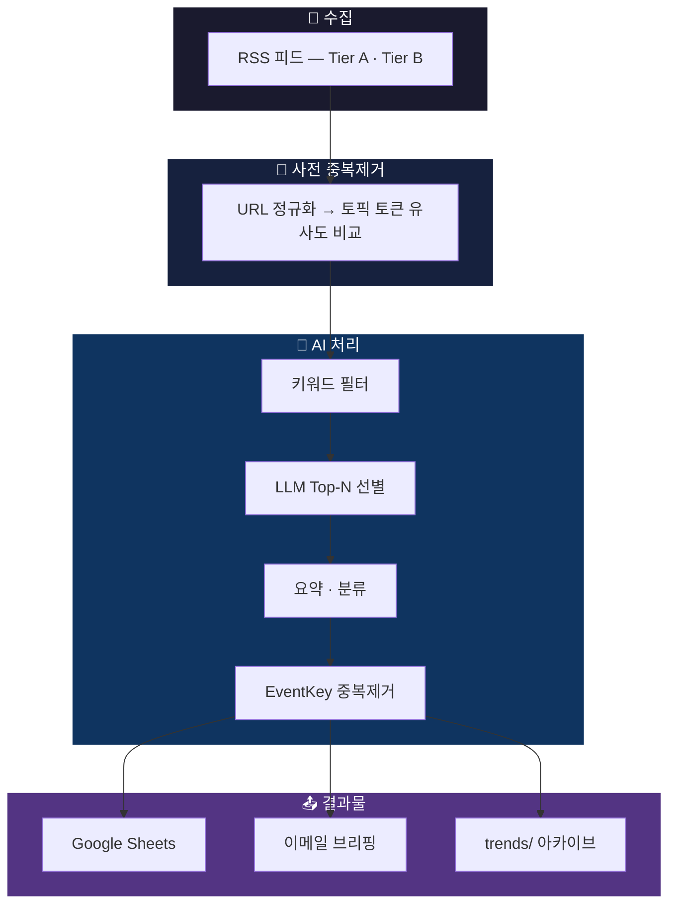

<div align="center">

# auto-newsbriefing

**RSS → AI → 브리핑, 자동으로.**

[](https://python.org)
[](https://anthropic.com)
[](https://openai.com)
[](https://ai.google.dev)
[](LICENSE)

어떤 분야든 RSS 뉴스를 수집해서 AI로 분류하고 요약한 뒤,<br>
Google Sheets에 정리하고 이메일 브리핑까지 보내주는 자동화 도구입니다.

[**English**](README.md)



</div>

---

## 주요 기능

- **멀티 LLM 지원** — Claude, OpenAI, Gemini 중 원하는 모델을 config 한 줄로 교체
- **3단계 중복제거** — URL 정규화 → 토픽 토큰 유사도 → EventKey 핑거프린팅
- **Google Sheets 아카이브** — 헤더 자동 생성, 구조화된 데이터 저장
- **HTML 이메일 브리핑** — 카테고리별로 정리된 뉴스레터를 Gmail로 발송
- **GitHub Actions 자동화** — 수동 실행 또는 선택적 스케줄 실행, 트렌드 파일 자동 커밋
- **셋업 위저드** — 대화형 CLI로 처음부터 끝까지 설정
- **완전한 설정 분리** — 도메인, 카테고리, 키워드, 소스, 스케줄 전부 `config.yaml`에서 관리

## 빠른 시작

```bash
git clone https://github.com/kipeum86/auto-newsbriefing.git
cd auto-newsbriefing
pip install -r requirements.txt
cp .env.example .env          # API 키 입력
python -m pipeline.setup.wizard
python main.py --dry-run      # Sheets/이메일 없이 테스트
```

## 사전 준비

| 항목 | 비고 |
|------|------|
| Python 3.12 이상 | 3.12~3.14에서 테스트 완료 |
| LLM API 키 | Anthropic, OpenAI, Google AI 중 하나 |
| Google Cloud 서비스 계정 | Google Sheets API용 (무료 티어로 충분) |
| Gmail + 앱 비밀번호 | 선택 — 이메일 발송이 필요할 때만 |
| GitHub 저장소 | 선택 — 스케줄 자동 실행이 필요할 때만 |

## 셋업 가이드

### 1단계: 저장소 클론 및 패키지 설치

```bash
git clone https://github.com/kipeum86/auto-newsbriefing.git
cd auto-newsbriefing
pip install -r requirements.txt
```

### 2단계: API 키 준비

#### LLM 프로바이더 (하나만 선택)

| 프로바이더 | 키 발급 | 환경변수 |
|-----------|--------|---------|
| Claude | [console.anthropic.com](https://console.anthropic.com/) | `ANTHROPIC_API_KEY` |
| OpenAI | [platform.openai.com](https://platform.openai.com/api-keys) | `OPENAI_API_KEY` |
| Gemini | [aistudio.google.com](https://aistudio.google.com/apikey) | `GOOGLE_API_KEY` |

#### Google Sheets 서비스 계정 만들기

1. [Google Cloud Console](https://console.cloud.google.com/)에 로그인
2. 프로젝트를 새로 만들거나 기존 프로젝트 선택
3. **Google Sheets API**와 **Google Drive API**를 켜야 합니다:
   - 좌측 메뉴에서 *API 및 서비스 → 라이브러리*로 이동
   - 각각 검색해서 *사용 설정* 클릭
4. 서비스 계정 생성:
   - *IAM 및 관리자 → 서비스 계정*으로 이동
   - *서비스 계정 만들기* 클릭
   - 이름은 자유롭게 (예: `newsbriefing-bot`), 나머지는 기본값으로 *완료*
5. JSON 키 다운로드:
   - 방금 만든 서비스 계정 클릭 → *키* 탭 → *키 추가 → 새 키 만들기 → JSON*
   - `.json` 파일이 다운로드됩니다. 잃어버리지 않게 안전한 곳에 저장하세요
6. 이 파일의 경로를 `.env`의 `GOOGLE_SHEETS_CREDENTIALS`에 적으면 됩니다

#### Gmail 앱 비밀번호 (이메일 발송이 필요한 경우만)

1. Google 계정에서 [2단계 인증](https://myaccount.google.com/security)을 먼저 켜세요
2. [앱 비밀번호](https://myaccount.google.com/apppasswords) 페이지에서 비밀번호 생성
3. 나오는 16자리 비밀번호를 `.env`의 `SMTP_PASS`에 붙여넣으면 됩니다

### 3단계: 환경변수 설정

```bash
cp .env.example .env
```

`.env` 파일을 열어서 키를 입력합니다:

```env
# LLM — 사용할 프로바이더 키만 채우면 됩니다
ANTHROPIC_API_KEY=sk-ant-...
# OPENAI_API_KEY=sk-...
# GOOGLE_API_KEY=AI...

# Google Sheets
GOOGLE_SHEETS_CREDENTIALS=/path/to/service-account-key.json

# 이메일 (필요한 경우만)
SMTP_USER=you@gmail.com
SMTP_PASS=abcd efgh ijkl mnop

# 로그 레벨
LOG_LEVEL=INFO
```

### 4단계: 브리핑 설정

**방법 A: 셋업 위저드 사용 (권장)**

```bash
python -m pipeline.setup.wizard
```

8단계에 걸쳐 하나씩 물어봅니다: API 키 검증 → 도메인 설정 → 카테고리 → 키워드 → RSS 소스 → Google Sheets 생성 → 이메일 수신자 → 저장.

**방법 B: 예시 설정 파일 복사**

```bash
cp config.example.yaml config.yaml
```

`config.yaml`을 열어서 원하는 도메인에 맞게 수정하면 됩니다.

#### config.yaml 각 섹션 설명

| 섹션 | 하는 일 |
|------|--------|
| `domain` | 브리핑 도메인 이름, 설명, 출력 언어 |
| `categories` | AI가 기사를 분류할 카테고리 목록 (이름 + 설명) |
| `keywords` | LLM 호출 전에 걸러내는 포함/제외 키워드 |
| `sources` | RSS 피드 URL — `tier_a`는 안정적인 소스, `tier_b`는 불안정해도 괜찮은 소스 |
| `llm` | 프로바이더 (`claude`/`openai`/`gemini`), 모델명, 최대 입력 글자수 |
| `email` | 발신자 이름, 메일 제목 접두사, 수신자 목록 |
| `sheets` | Google Sheets ID (위저드가 자동으로 채워줍니다) |
| `schedule` | cron 표현식과 타임존 (GitHub Actions 설정 시 참고) |

### 5단계: 테스트

```bash
# 전체 파이프라인 테스트 (Sheets 업로드와 이메일만 건너뜀)
python main.py --dry-run

# LLM 호출 없이 RSS 수집/중복제거만 확인
python main.py --dry-run --no-llm

# 기사 3건만 처리해보기
python main.py --dry-run --max-items 3
```

정상 동작하면 카테고리별로 분류·요약된 기사 목록이 `DRY RUN SUMMARY`로 출력됩니다.

### 6단계: GitHub Actions로 자동화하기

#### 6.1 Google Sheets 인증 파일을 base64로 변환

```bash
# macOS — 클립보드에 복사됨
cat /path/to/service-account-key.json | base64 | pbcopy

# Linux
cat /path/to/service-account-key.json | base64 -w 0
```

#### 6.2 GitHub에 Secret 등록

저장소 페이지 → *Settings → Secrets and variables → Actions → New repository secret*:

| Secret 이름 | 값 |
|-------------|-----|
| `ANTHROPIC_API_KEY` | LLM API 키 (OpenAI나 Gemini면 해당 키) |
| `GOOGLE_SHEETS_CREDENTIALS_B64` | 위에서 base64로 변환한 문자열 |
| `SMTP_USER` | Gmail 주소 (이메일 발송 시) |
| `SMTP_PASS` | Gmail 앱 비밀번호 (이메일 발송 시) |

#### 6.3 타임존 설정 (선택)

*Settings → Secrets and variables → Actions → Variables* 탭에서:

| Variable 이름 | 값 |
|--------------|-----|
| `BRIEFING_TZ` | `Asia/Seoul`, `America/New_York` 등 |

#### 6.4 실행 스케줄 활성화/변경

공개 템플릿에서 설정 전 cron 실패가 반복되지 않도록, 포함된 workflow는 기본적으로 수동 실행만 켜져 있습니다.
자동 실행을 켜려면 `.github/workflows/schedule.yml` 파일에서 schedule 블록의 주석을 해제하고 cron을 수정하세요:

```yaml
on:
  workflow_dispatch:
  schedule:
    - cron: '7 1 * * 1,3,5'   # UTC 기준 월/수/금 01:07 (한국 시간 10:07)
```

GitHub Actions 페이지에서 *Run workflow* 버튼으로 수동 실행도 가능합니다.

## CLI 사용법

```
python main.py [옵션]

  --dry-run          수집·처리만 하고 Sheets 업로드와 이메일은 건너뜀
  --no-llm           LLM을 아예 쓰지 않음 (RSS 수집/중복제거만 테스트할 때)
  --max-items N      처리할 기사 수를 N개로 제한
  --config PATH      다른 설정 파일 사용 (기본값: config.yaml)
```

```
python -m pipeline.setup.wizard [옵션]

  --from-example     빈 설정 대신 config.example.yaml을 기반으로 시작
```

## 파이프라인 구조

```
main.py
 ├─ [1/6] collector.py    → RSS 수집 + 날짜 필터
 ├─ [2/6] dedup.py        → URL/토픽토큰/Sheets·trends 중복제거
 ├─ [3/6] classifier.py   → 키워드 필터 + LLM Top-N 선별
 ├─ [4/6] classifier.py   → 본문 추출 + LLM 요약/분류
 ├─ [5/6] dedup.py        → EventKey 기반 사후 중복제거
 └─ [6/6] archiver.py     → Google Sheets 업로드
          mailer.py        → HTML 이메일 발송
          dedup.py         → trends/ 로컬 아카이브 저장
```

## 프로젝트 디렉토리

```
pipeline/
├── config.py          # 설정 로드, 검증, 기본값 적용
├── collector.py       # RSS 파싱 + 본문 스크래핑
├── dedup.py           # 3단계 중복제거 + 트렌드 스냅샷
├── classifier.py      # 키워드 필터, Top-N 선별, 요약
├── archiver.py        # Google Sheets 업로드 + 스냅샷
├── mailer.py          # HTML 이메일 생성 + SMTP 발송
├── models.py          # 데이터 클래스 (Article, AIResult 등)
├── llm/
│   ├── base.py        # 프로바이더 인터페이스 + 프롬프트 빌더
│   ├── claude.py      # Anthropic Claude
│   ├── openai.py      # OpenAI GPT
│   └── gemini.py      # Google Gemini
└── setup/
    ├── wizard.py      # 대화형 셋업 CLI
    ├── sheets_creator.py  # 스프레드시트 자동 생성
    └── validator.py   # API 키 유효성 검사
```

## 문제 해결

| 증상 | 해결 방법 |
|------|----------|
| `ModuleNotFoundError: No module named 'yaml'` | `pip install -r requirements.txt`를 먼저 실행하세요 |
| `config.yaml not found` | `python -m pipeline.setup.wizard`로 설정 파일을 만들거나, `cp config.example.yaml config.yaml`로 복사하세요 |
| `ANTHROPIC_API_KEY not set` | `.env` 파일에 키를 넣고 터미널을 다시 여세요 |
| `Google Sheets credentials not found` | `.env`에 적은 JSON 파일 경로가 맞는지 확인하세요 (절대 경로 추천) |
| `SMTP connection failed` | Google 계정의 2단계 인증이 켜져 있어야 합니다. 앱 비밀번호를 새로 생성해보세요 |
| `No articles collected` | RSS 피드 URL에 직접 접속되는지 확인하세요. `--no-llm`으로 분리 테스트해보세요 |
| GitHub Actions에서 인증 에러 | `cat key.json \| base64`로 다시 인코딩하세요 (줄바꿈이 들어가면 안 됩니다) |
| 키워드 필터 후 0건 | `keywords.include`를 넓히거나 `[]`로 비워서 필터를 끄세요 |

## 라이선스

MIT
